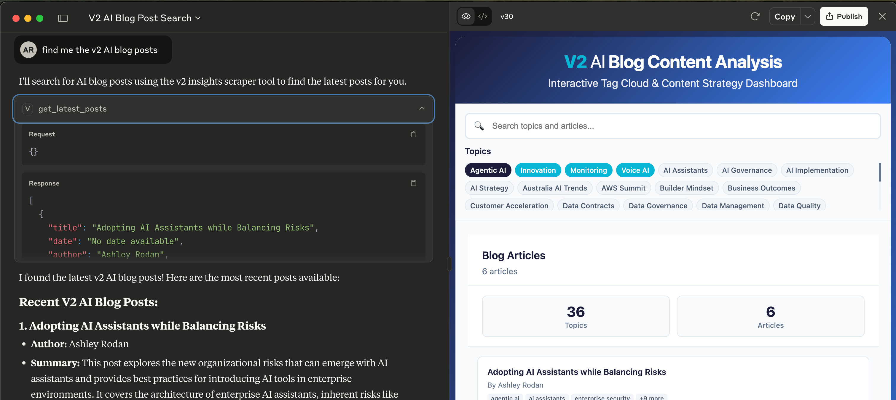

# V2.ai Insights Scraper MCP

A Model Context Protocol (MCP) server that scrapes blog posts from V2.ai Insights, extracts content, and provides AI-powered summaries using OpenAI's GPT-4.

# Example


## Features

- 🔍 **Web Scraping**: Fetches blog posts from V2.ai Insights
- 📝 **Content Extraction**: Extracts title, date, author, and content
- 🤖 **AI Summarization**: Generates summaries using OpenAI GPT-4
- 🔧 **MCP Integration**: Exposes tools for Claude Desktop integration

## Tools Available

- `get_latest_posts()` - Retrieves blog posts with metadata
- `summarize_post(index)` - Returns AI-generated summary of a specific post
- `get_post_content(index)` - Returns full content of a specific post

## Setup

### Prerequisites

- Python 3.12+
- [uv](https://docs.astral.sh/uv/) package manager
- OpenAI API key

### Installation

1. **Clone and navigate to project:**
   ```bash
   cd v2-ai-mcp
   ```

2. **Install dependencies:**
   ```bash
   uv add fastmcp beautifulsoup4 requests openai
   ```

3. **Set up OpenAI API key:**
   ```bash
   export OPENAI_API_KEY="your-api-key-here"
   ```

   Or create a `.env` file:
   ```
   OPENAI_API_KEY=your-api-key-here
   ```

### Running the Server

```bash
uv run python -m src.v2_ai_mcp.main
```

The server will start and be available for MCP connections.

### Testing the Scraper

Test individual components:

```bash
# Test scraper
uv run python -c "from src.v2_ai_mcp.scraper import fetch_blog_posts; print(fetch_blog_posts()[0]['title'])"

# Test with summarizer (requires OpenAI API key)
uv run python -c "from src.v2_ai_mcp.scraper import fetch_blog_posts; from src.v2_ai_mcp.summarizer import summarize; post = fetch_blog_posts()[0]; print(summarize(post['content'][:1000]))"

# Run unit tests
uv run pytest tests/ -v --cov=src
```

## Claude Desktop Integration

### Configuration

1. **Install Claude Desktop** (if not already installed)

2. **Configure MCP in Claude Desktop:**

   Add to your Claude Desktop MCP configuration:
   ```json
   {
     "mcpServers": {
       "v2-insights-scraper": {
         "command": "/path/to/uv",
         "args": ["run", "--directory", "/path/to/your/v2-ai-mcp", "python", "-m", "src.v2_ai_mcp.main"],
         "env": {
           "OPENAI_API_KEY": "your-api-key-here",
           "CONTENTFUL_SPACE_ID": "nea6p9w6oir5",
          "CONTENTFUL_ACCESS_TOKEN": "<get it from ash>",
          "CONTENTFUL_CONTENT_TYPE": "pageBlogPost"
         }
       }
     }
   }
   ```

3. **Restart Claude Desktop** to load the MCP server

### Using the Tools

Once configured, you can use these tools in Claude Desktop:

- **Get latest posts**: `get_latest_posts()`
- **Summarize post**: `summarize_post(0)` (index 0 for first post)
- **Get full content**: `get_post_content(0)`

## Project Structure

```
v2-ai-mcp/
├── src/
│   └── v2_ai_mcp/
│       ├── __init__.py      # Package initialization
│       ├── main.py          # FastMCP server with tool definitions
│       ├── scraper.py       # Web scraping logic
│       └── summarizer.py    # OpenAI GPT-4 integration
├── tests/
│   ├── __init__.py          # Test package initialization
│   ├── test_scraper.py      # Unit tests for scraper
│   └── test_summarizer.py   # Unit tests for summarizer
├── .github/
│   └── workflows/
│       └── ci.yml           # GitHub Actions CI/CD pipeline
├── pyproject.toml           # Project dependencies and config
├── .env.example             # Environment variables template
├── .gitignore               # Git ignore patterns
└── README.md                # This file
```

## Current Implementation

The scraper currently targets this specific blog post:
- URL: `https://www.v2.ai/insights/adopting-AI-assistants-while-balancing-risks`

### Extracted Data

- **Title**: "Adopting AI Assistants while Balancing Risks"
- **Author**: "Ashley Rodan"
- **Date**: "July 3, 2025"
- **Content**: ~12,785 characters of main content

## Development

### Adding More Blog Posts

To scrape multiple posts or different URLs, modify the `fetch_blog_posts()` function in `scraper.py`:

```python
def fetch_blog_posts() -> list:
    urls = [
        "https://www.v2.ai/insights/post1",
        "https://www.v2.ai/insights/post2",
        # Add more URLs
    ]
    return [fetch_blog_post(url) for url in urls]
```


### Improving Content Extraction

The scraper uses multiple fallback strategies for extracting content. You can enhance it by:

1. Inspecting V2.ai's HTML structure
2. Adding more specific CSS selectors
3. Improving date/author extraction patterns

## Troubleshooting

### Common Issues

1. **OpenAI API Key Error**: Ensure your API key is set in environment variables
2. **Import Errors**: Run `uv sync` to ensure all dependencies are installed
3. **Scraping Issues**: Check if the target URL is accessible and the HTML structure hasn't changed

### Testing Components

```bash
# Test scraper only
uv run python -c "from src.v2_ai_mcp.scraper import fetch_blog_posts; posts = fetch_blog_posts(); print(f'Found {len(posts)} posts')"

# Run full test suite
uv run pytest tests/ -v --cov=src

# Test MCP server startup
uv run python -m src.v2_ai_mcp.main
```

## Development

### Running Tests

```bash
# Run all tests
uv run pytest

# Run with coverage
uv run pytest --cov=src --cov-report=html

# Run specific test file
uv run pytest tests/test_scraper.py -v
```

### Code Quality

```bash
# Format code
uv run ruff format src tests

# Lint code
uv run ruff check src tests

# Fix auto-fixable issues
uv run ruff check --fix src tests
```

## License

This project is for educational and development purposes.
